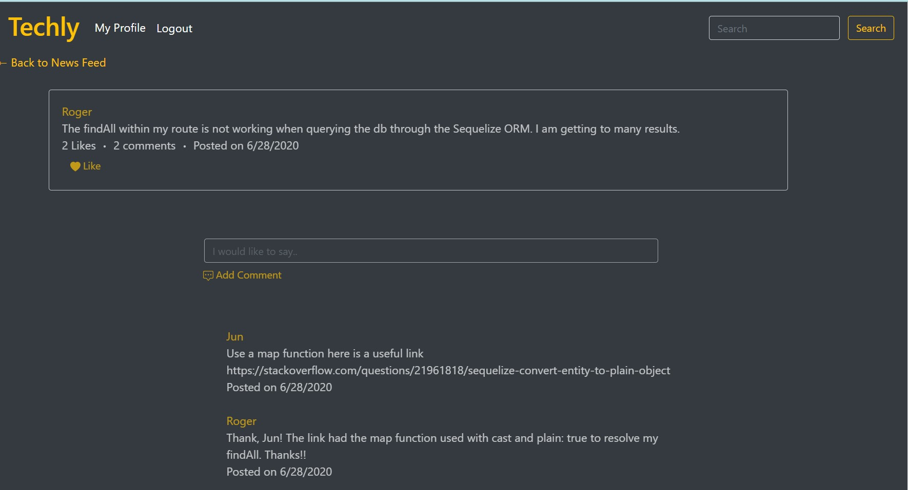

# Techly-KND

## GitHub repo
https://github.com/ktrnthsnr/Techly-KND

## Heroku
[Techly-KND](https://ktrnthsnr-techly.herokuapp.com/)

## Description 
The Node.js application is a social networking forums style site where developers may add questions in posts or comment on other developers' posts. This application follows the MVC paradigm in its structure and uses Handlebars.js as the templating language, Sequelize as the ORM, and the express-session npm package for authentication. 

## Table of Contents
* [Installation](#installation)
* [Usage](#usage)
* [License](#license)
* [Contributing](#contributing)
* [Tests](#tests)
* [Questions](#questions)

## Installation 
- The user may clone this repository from GitHub. This application requires Node.js, Express.js, Sequelize, mysql2, connection-session/express-session, and Jest. 
- If cloning the repo, run `npm i` to install all the dependent modules. 
- To connect to the database run `mysql -u root -p` and enter your password, the same you'll add to your .env file. A sample .env_sample is included which contains the info you will need in your .env file (but you'd just remove the `_sample` from the filename).
- Then run `source schema.sql` to create the database.
- To start the Express server, run `npm start` from the bash terminal.
- After running `npm start` the tables will be created with no rows. To add the rows, you may run the INSERT statements through the mysql command line, located at db/techly_knd_db3.sql

## Usage 
This application will allow users to sign up, then login and add posts, comments to other posts, and vote up useful posts. Users will also be able to search by keywords for any related technical issue, and view a user's profile.  
The site is currently hosted on the Heroku platform - [Techly](https://ktrnthsnr-techly.herokuapp.com/). 

- Attached is a walkthrough of the simple social forum type application
https://drive.google.com/file/d/1Dnp2MLb1cqJ0OAgde9IxXSN6WUymz0hU/view

## License 
This project is licensed under MIT

## Contributing 
Contributors of this project include Nicole Wallace for the posts and comments, David Stahl for the profile feature, and Asa Thisner for the search box functionality. 

## Tests
The tests in this application verifies data formatting using Jest. To test run npm test  

## Questions
For any questions on this repo, my contact info is at this location: https://ktrnthsnr.github.io/ktportfolio/